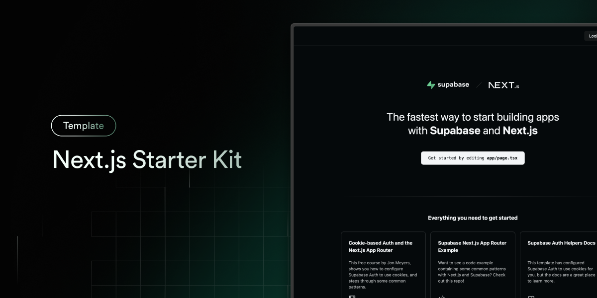

# AKH Web Project

A modern, full-stack web application built for the **Absolventské křesťanské
hnutí (AKH)**. This platform facilitates community connection, event management,
and information sharing for Christian graduates in the Czech Republic.



## 🌟 Features

- **Communities (Společenství)**: Interactive directory of local graduate groups
  with map integration.
- **Dynamic Content**: Fully editable headers, partner lists, and contact
  details via the admin panel.
- **Events (Akce)**: Upcoming events listing with detailed information and
  registration links.
- **Admin Dashboard**: Secure interface with **Role-Based Access Control** and
  **Explicit Save** mechanism for safety.
- **Content pages**: About Us, Contact, Support, and useful links.
- **Blog**: Integrated blogging platform (feature-flagged).

## 🛠 Technology Stack

The project leverages a modern React architecture optimized for performance and
type safety.

### Core

- **Framework**: [Next.js 15](https://nextjs.org/) (App Router, Server Actions,
  SSR/SSG).
- **Language**: [TypeScript](https://www.typescriptlang.org/) for full-stack
  type safety.
- **Database**: [Supabase](https://supabase.com/) (PostgreSQL).
- **Auth**: Supabase Auth with Role-Based Access Control (RBAC).

### Frontend & UI

- **Styling**: [Tailwind CSS](https://tailwindcss.com/) with `next-themes`
  (Dark/Light mode).
- **Components**: [shadcn/ui](https://ui.shadcn.com/) (Radix UI primitives).
- **Icons**: [Lucide React](https://lucide.dev/).
- **Rich Text**: [Tiptap](https://tiptap.dev/) for content editing.
- **Forms**: `react-hook-form` + `zod` validation.

## 📂 Project Structure

```bash
├── app/                  # Next.js App Router (pages & layouts)
│   ├── (admin)/          # Protected Admin interface
│   ├── api/              # API Routes
│   ├── akce/             # Events feature
│   ├── spolecenstvi/     # Communities feature
│   └── ...               # Other public routes
├── components/           # React Components
│   ├── ui/               # Reusable shadcn/ui primitives
│   └── ...               # Feature-specific components
├── lib/                  # Utilities, types, and constants
│   └── supabase/         # Supabase Client/Server helpers
├── public/               # Static assets (images, documents)
├── scripts/              # Maintenance, migration & MCP scripts
├── sites/                # Standalone subsites (separate from Next.js)
│   └── praha/            # praha.akhcr.cz – deployed via GitHub Pages
└── supabase/             # Database migrations & schemas
```

## 🚀 Getting Started

### Prerequisites

- Node.js 20+
- npm or pnpm
- Supabase Project

### 1. Clone & Install

```bash
git clone <repo_url>
cd akhweb
npm install
```

### 2. Environment Setup

Create a `.env.local` file in the root directory:

```bash
NEXT_PUBLIC_SUPABASE_URL=your_project_url
NEXT_PUBLIC_SUPABASE_ANON_KEY=your_anon_key
DATABASE_URL=your_postgres_connection_string
# Optional: Service role for admin scripts
SUPABASE_SERVICE_ROLE_KEY=your_service_key
```

### 3. Run Locally

```bash
npm run dev
```

## 🔐 Security & Administration

- **RBAC**: Access follows a strict hierarchy (`admin` > `editor` > `user`).
- **Middleware**: Protected routes (`/admin/*`) are guarded by Next.js
  Middleware.
- **RLS**: Row-Level Security policies in Postgres ensure data isolation and
  safety.
- **Admin Access**:
  - Navigate to `/admin` to log in.
  - Use the "View on web" action in admin tables to preview changes live.

## 📦 Deployment

### Cloudflare

1. Connect the repository to Cloudflare Pages.
2. Set the production environment variables (`NEXT_PUBLIC_SUPABASE_URL`, `NEXT_PUBLIC_SUPABASE_ANON_KEY`).
3. Build and deploy the Next.js app from Cloudflare.

## 🌐 Praha Subsite

The site **[praha.akhcr.cz](https://praha.akhcr.cz)** is a standalone static
page hosted on **GitHub Pages**, separate from the main Next.js application.

- **Location**: `sites/praha/`
- **Deployment**: Automatic via GitHub Actions (`.github/workflows/deploy-praha.yml`)
- **Trigger**: Any push to `main` that changes files in `sites/praha/`
- **DNS**: CNAME record `praha` → `akh-cr.github.io`

The page shares the same visual design (Inter font, color scheme, dark mode) as
the main site but is a plain HTML/CSS file with no build step.

## 🗄 Database & Maintenance

Scripts are located in the `scripts/` directory for database management and
maintenance tasks.

- `apply_migration.js`: Applies local SQL migrations to the remote database.
- `verify_security.js`: Audits RLS policies and security settings.
- `archive/`: Contains legacy scripts (e.g., initial setup tools).

### AI Integration (MCP)

This project is configured with
[Model Context Protocol (MCP)](https://modelcontextprotocol.io/) servers for
AI-assisted development.

- `scripts/start-mcp-db.sh`: Direct Postgres access.
- `scripts/start-mcp-supabase.sh`: Supabase Management API access.
